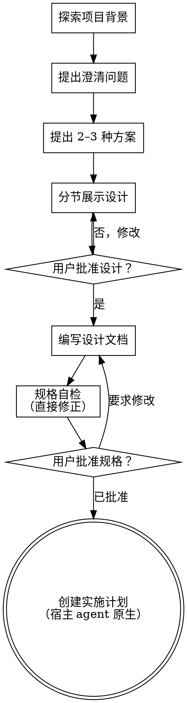

# 将创意梳理成设计

通过自然的协作式对话，把想法发展为完整的设计与规格说明。

先了解当前项目背景，再逐个提问以细化想法。理解要构建的内容后，展示设计并取得用户批准。

<HARD-GATE>
在展示设计并获得用户批准之前，不得调用任何实现类 skill、编写代码、搭建项目脚手架或采取任何实现行动。无论项目看起来多么简单，此规则都适用。
</HARD-GATE>

## 反模式：“这太简单，不需要设计”

每个项目都要经过这套流程。待办清单、单函数工具、配置修改——无一例外。“简单”项目最容易因未经检验的假设造成浪费。对于真正简单的项目，设计可以很短（几句话即可），但仍必须展示设计并取得批准。

## 检查清单

必须为下列每一项创建任务，并按顺序完成：

1. **探索项目背景**——检查文件、文档和近期提交
2. **在恰当时机提供可视化 companion**——不要预先询问。第一次遇到确实“看图比文字更清楚”的问题时，单独发送邀请；用户同意后为其打开浏览器标签页。如果从未出现视觉问题，就不要邀请。详见下方“可视化 Companion”
3. **提出澄清问题**——一次一个，理解目的、约束和成功标准
4. **提出 2–3 种方案**——说明权衡并给出推荐
5. **展示设计**——按复杂度分节展示，每节后取得用户批准
6. **编写设计文档**——保存到 `docs/superpowers/specs/YYYY-MM-DD-<topic>-design.md` 并提交
7. **规格自检**——快速检查占位符、矛盾、歧义和范围（见下文）
8. **由用户审阅书面规格**——继续前请用户审阅规格文件
9. **转入实现**——使用宿主 agent 的原生计划能力创建实施计划

## 流程图

**终点状态是通过宿主 agent 的原生计划能力创建实施计划。** 不得调用 frontend-design、mcp-builder、writing-plans 或其他实现类 skill。在用户批准计划之前，不得编写代码——只产出计划并等待确认。

## 具体流程

**理解想法：**

- 先检查项目当前状态（文件、文档、近期提交）
- 在细问之前先评估范围：如果需求包含多个相互独立的子系统（例如“构建一个含聊天、文件存储、计费和分析的平台”），立刻指出。不要花时间细化一个本应先拆分的项目
- 如果项目大到无法用一份规格覆盖，帮助用户拆成子项目：哪些部分彼此独立、它们如何关联、应该按什么顺序构建？然后按常规设计流程梳理第一个子项目。每个子项目都独立经历“规格 → 计划 → 实现”周期
- 对范围合适的项目，一次只问一个问题以细化想法
- 尽量使用选择题，开放式问题也可以
- 每条消息只问一个问题；某个主题需要深入时，拆成多轮
- 聚焦理解：目的、约束、成功标准

**探索方案：**

- 提出 2–3 种差异明确的方案及其权衡
- 以对话方式给出选项、推荐和理由
- 先讲推荐方案并解释原因
- 严格遵循 YAGNI，从每种方案和设计中移除不必要功能

**展示设计：**

- 确信已经理解要构建的内容后，再展示设计
- 各节篇幅与复杂度相称：简单内容用几句话，复杂内容最多约 200–300 字
- 每节后询问目前是否正确
- 覆盖架构、组件、数据流、错误处理和测试
- 若有不清楚之处，随时返回澄清

**为隔离性和清晰度而设计：**

- 将系统拆成职责单一的小单元，通过清晰接口通信，并可独立理解和测试
- 对每个单元都应能回答：它做什么、如何使用、依赖什么？
- 不读内部实现能否理解它？更换内部实现会不会破坏调用方？如果不能，说明边界仍需改进
- 小而边界清晰的单元也更便于 agent 工作：有限上下文内更容易推理，聚焦的文件也更容易可靠修改。文件过大往往意味着职责过多

**在现有代码库中工作：**

- 提案前先探索当前结构并遵循现有模式
- 如果现有问题会影响本次工作（如文件过大、边界模糊、职责纠缠），应在设计中纳入有针对性的改进，就像优秀开发者会顺手改善正在接触的代码
- 不提议无关重构；只做服务于当前目标的调整

## 设计之后

**文档：**

- 将已验证的设计（规格）写入 `docs/superpowers/specs/YYYY-MM-DD-<topic>-design.md`
  - 用户指定的位置优先于此默认路径
- 若 elements-of-style:writing-clearly-and-concisely skill 可用，则使用它
- 将设计文档提交到 git

**规格自检：**

写完规格文档后，以全新视角检查：

1. **占位符扫描：** 是否存在 “TBD”“TODO”、未完成章节或含糊要求？立即修正
2. **内部一致性：** 各节是否矛盾？架构是否与功能描述一致？
3. **范围检查：** 是否足够聚焦，可由单一实施计划覆盖？是否需要继续拆分？
4. **歧义检查：** 是否有需求可被理解成两种含义？若有，选择一种并明确写出

直接修正发现的问题，不需要再次复审。

**用户审阅门禁：**

规格自检通过后，请用户先审阅书面规格：

> “规格已写入并提交到 `<path>`。请审阅，如希望修改，请在我们开始编写实施计划前告诉我。”

等待用户回应。如果用户要求修改，完成修改并再次执行规格自检。只有用户批准后才能继续。

**实施计划：**

- 使用宿主 agent 的原生计划能力创建详细实施计划
- 在 Cursor 中：若已在 Plan mode，直接调用 `CreatePlan`；否则先请求切换到 Plan mode，再提交计划供用户批准，之后才能改代码
- 计划应覆盖：要修改的文件、任务拆分、测试方式，以及从已批准规格提炼出的关键实现决策
- 不得调用 writing-plans 或其他 skill。用户批准计划前不得编写代码

## 可视化 Companion

一种基于浏览器的辅助工具，用于在 brainstorming 期间展示模型图、示意图和视觉选项。它是工具，不是模式。用户接受 companion 仅表示视觉问题出现时可以使用浏览器，并不代表每个问题都要在浏览器中处理。

**在恰当时机邀请：** 不要预先邀请。等到某个问题确实“展示比描述更清楚”时——例如真正的模型图、布局或示意图问题，而非仅仅涉及 UI 的话题——再单独发送：

> “接下来的内容用展示可能更容易理解——我可以在浏览器标签页中提供模型图、示意图和对比方案。这个功能仍较新，可能消耗较多 token。要使用吗？我会为你打开。”

**邀请必须独占一条消息。** 不要附带澄清问题、摘要或其他内容，等待用户回应。若用户接受，用 `--open` 启动服务器，使浏览器自动打开第一个画面；若拒绝，则继续纯文本流程，除非用户后来主动提及，否则不要重复邀请。

**逐题判断：** 即便用户已经接受，也要对每个问题单独判断是否使用浏览器。判断标准是：**用户通过观看是否会比阅读理解得更好？**

- **使用浏览器：** 内容本身具有视觉性——模型图、线框图、布局对比、架构图、并排视觉方案
- **使用终端：** 文字型内容——需求问题、概念选择、权衡列表、A/B/C/D 文本选项、范围决策

涉及 UI 的话题不等于视觉问题。“这里的个性是什么意思？”属于概念问题，应使用终端。“哪种向导布局更好？”属于视觉问题，应使用浏览器。

如果用户同意使用 companion，继续前完整阅读详细指南：
`skills/brainstorming/visual-companion.md`
